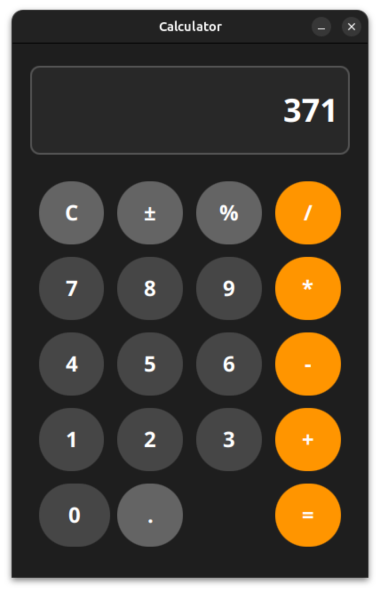

# JavaFX Calculator

Современный калькулятор с красивым интерфейсом, написанный на JavaFX. Поддерживает управление с клавиатуры и мыши, имеет темную тему и профессиональную архитектуру.

<div align="center">
  <figure>
    
    <figcaption><em>Современный калькулятор на JavaFX с темной темой</em></figcaption>
  </figure>
</div>

## Особенности

### Функциональность
- **Базовые операции**: сложение, вычитание, умножение, деление
- **Дополнительные функции**: проценты (%), смена знака (±), очистка (C)
- **Управление с клавиатуры**: полная поддержка клавиш и Numpad
- **Обработка ошибок**: деление на ноль, некорректный ввод
- **Корректное округление**: автоматическое удаление лишних нулей

### Дизайн
- **Темная тема**: современный минималистичный дизайн
- **Анимации**: эффекты при наведении и нажатии
- **Адаптивный интерфейс**: фиксированный размер 400×600px
- **Профессиональные цвета**: оранжевые операторы, серые цифры

### Управление
- **Мышь**: клик по всем кнопкам
- **Клавиатура**: цифры, Enter, Escape, Backspace
- **Numpad**: полная поддержка цифровой клавиатуры
- **Горячие клавиши**:
  - `Enter` или `=` - вычисление
  - `Escape` или `Delete` - очистка
  - `Backspace` - удаление символа
  - `Shift + =` - знак плюс

## Структура проекта

```
calculator/
├── src/main/java/ru/levitsky/calculator/
│   ├── Calculator.java              # Главный класс приложения
│   ├── constants/
│   │   ├── CalculatorConstants.java # Математические константы
│   │   ├── UIConstants.java         # Цвета и UI константы
│   │   └── UIStyleConstants.java    # Стили и размеры
│   └── util/
│       └── Utils.java               # Вспомогательные функции
├── pom.xml                          # Maven конфигурация
└── README.md                        # Документация
```

## Быстрый старт

### Предварительные требования
- Java 25 (JDK 25 и выше)
- JavaFX SDK 21.0.6 (автоматически загружается через Maven)
- Maven 3.8+

### Запуск из IDE (IntelliJ IDEA/Eclipse)
1. Клонируйте репозиторий
2. Откройте проект в IDE
3. Убедитесь, что JavaFX SDK подключен
4. Запустите `Calculator.java`

### Запуск из командной строки

#### Сборка с Maven:
```bash
mvn clean compile
mvn javafx:run
```

## Настройка для разработчиков

### Конфигурация Maven (`pom.xml`):
```xml
<dependencies>
    <dependency>
        <groupId>org.openjfx</groupId>
        <artifactId>javafx-controls</artifactId>
        <version>21</version>
    </dependency>
    <dependency>
        <groupId>org.openjfx</groupId>
        <artifactId>javafx-fxml</artifactId>
        <version>21</version>
    </dependency>
</dependencies>
```

## Как пользоваться

### Базовые вычисления:
```
1. Введите первое число (например, 123.45)
2. Нажмите оператор (+, -, ×, ÷)
3. Введите второе число (например, 67.89)
4. Нажмите = или Enter для получения результата
```

### Особенности:
- **Точка**: автоматически добавляется только один раз
- **Очистка**: `C` сбрасывает все вычисления
- **Смена знака**: `±` инвертирует знак текущего числа
- **Проценты**: `%` делит число на 100

## Тестирование

Калькулятор был протестирован на следующих сценариях:
- Базовые арифметические операции
- Деление на ноль (показывает сообщение об ошибке)
- Работа с десятичными числами
- Управление с клавиатуры
- Обработка больших чисел
- Корректное округление

## Архитектурные решения

### Разделение ответственности:
- **Calculator.java**: контроллер и представление
- **Константы**: отдельные классы для UI и логики
- **Утилиты**: переиспользуемые функции проверки

### Обработка событий:
```java
// Двухуровневая система событий
addEventFilter(KeyEvent.KEY_TYPED, this::handleKeyTyped);   // Обработанные символы
addEventFilter(KeyEvent.KEY_PRESSED, this::handleSpecialKeys); // Специальные клавиши
```

### Управление состоянием:
```java
private double num1, num2;          // Операнды
private String operator;            // Текущая операция
private boolean startNewNumber;     // Флаг начала нового числа
private boolean calculationDone;    // Флаг завершения вычисления
```

## Планы развития

### Версия 2.0 (в разработке):
- [ ] История вычислений
- [ ] Кнопки памяти (M+, M-, MR, MC)
- [ ] Поддержка Ctrl+C/V для копирования/вставки

### Версия 3.0 (планируется):
- [ ] Научный режим (sin, cos, sqrt, степени)
- [ ] Конвертер единиц измерения
- [ ] Светлая/темная тема
- [ ] Поддержка выражений

## Вклад в проект

Приветствуются Pull Requests! Для крупных изменений сначала откройте Issue для обсуждения.

1. Форкните репозиторий
2. Создайте ветку для фичи (`git checkout -b feature/amazing-feature`)
3. Закоммитьте изменения (`git commit -m 'Add amazing feature'`)
4. Запушьте ветку (`git push origin feature/amazing-feature`)
5. Откройте Pull Request

## Лицензия

Этот проект распространяется под лицензией MIT. Подробнее см. в файле [LICENSE](LICENSE).

## Автор

**Levitsky**
- GitHub: [Anatoliy Levitsky](https://github.com/Lewickiy)
- Проект: [JavaFX Calculator](https://github.com/Lewickiy/calculator)
